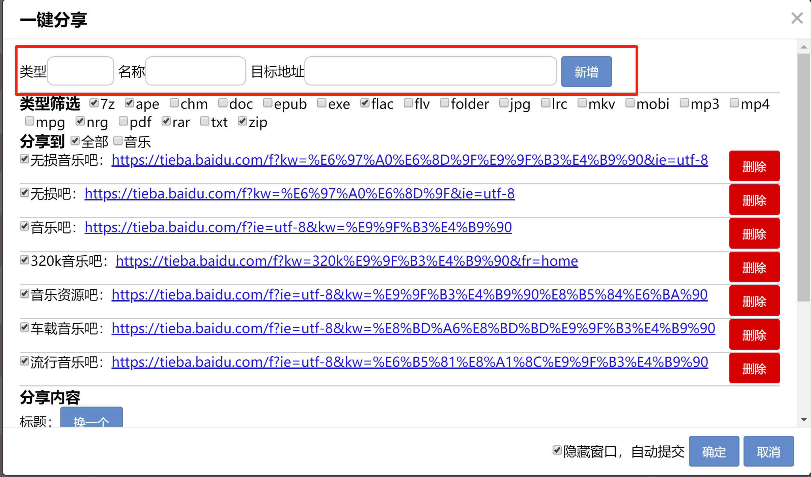

# 网盘工具使用说明
````
声明：网盘工具仅为操作提效而存在，不存在任何破解行为
````

## 下载地址
通过网盘分享的文件：pan-tools-win32-x64.rar
链接: https://pan.baidu.com/s/1cIBmQ3V9BFg1nYTNpQMpqQ?pwd=qj9b 提取码: qj9b
## 联系作者


## 打赏作者


## 使用步骤说明
#### 1、打开软件后，会跳转登录页面，首先登录城通网盘


#### 2、打开文件列表


#### 3、同步文件
````
所有的文件同步到本地之后，除了删除操作可选是否同时将网盘文件移动到回收站，其余操作均不再需要调用城通网盘接口
````

````
开始同步文件之后，会不断地将网上的文件同步到本地，等待完成即可
````


#### 4、一键分享贴吧
````
首先你需要新增需要分享到那个贴吧
类型：分了后续方便区分这个贴吧的类型，比如音乐，书籍之类
名称：贴吧名称
目标地址：贴吧的实际地址
````


````
类型筛选，这里制定需要分享的文件类型，比如你需要分享的是音乐，就可以通过这里过滤
````

````
这里是已经添加的贴吧列表，最顶部是所有的贴吧类型，就是新增贴吧时候填写的类型，这里可以用来过滤
删除：移除已经添加的贴吧
默认选中全部，即会分享到列表上的全部贴吧，当然你可以按需选择，只会分享到选中的贴吧列表
````


````
这里就是实际需要分享的内容，你可以按需修改标题
每次弹开这个弹窗将自动轮转下一个待分享的目标
目标不理想，你可以点击换一个
分享内容太少，通过下面的搜索框搜索内容，点击“追加分享”即可
````


````
这里会显示分享进度，没有100%之前不能关闭软件，否则分享会被强制终止
这里默认延迟3秒分享一个贴吧，分享太快容易弹出验证码，这个目前软件不支持自动处理
当然你也可以选择取消“隐藏窗口，自动提交”，然后选择手动提交，当然内容会自动给你填充到贴吧的新建窗口
````


